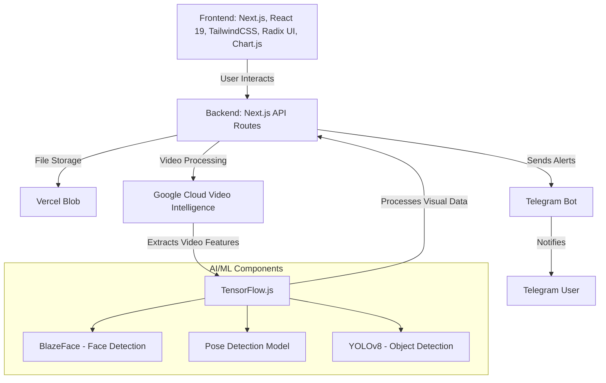

<<<<<<< HEAD
# Harassment-Detection-App
=======
# Harassment Detection App

A real-time harassment detection system that leverages AI and ML technologies to identify and prevent harassment incidents through video analysis.

## Architecture



##Features

- **Real-time Video Analysis**: Process live video streams for immediate harassment detection
- **Multi-modal Detection**: Combines visual, audio, and contextual analysis
- **Advanced AI Integration**: Uses multiple AI models for comprehensive analysis
- **Instant Alerting**: Real-time notifications through Telegram
- **User-friendly Interface**: Modern UI with React and TailwindCSS
- **Secure Storage**: Reliable file storage with Vercel Blob

## Tech Stack

### Frontend
- Next.js with React 19
- TailwindCSS for styling
- Radix UI for accessible components
- Chart.js for data visualization
- Real-time video processing with TensorFlow.js

### Backend
- Next.js API Routes
- Vercel Blob for file storage
- Google Cloud Video Intelligence API
- Telegram Bot API for notifications

### AI/ML Components
- TensorFlow.js for client-side ML
- BlazeFace for face detection
- Pose Detection for body language analysis
- YOLOv8 for object detection
- Google's Gemini AI for contextual analysis

##Prerequisites

- Node.js (v18 or higher)
- npm or yarn
- Google Cloud account with Video Intelligence API enabled
- Telegram Bot Token (for notifications)

## Getting Started

1. **Clone the repository**
```bash
git clone https://github.com/yourusername/Harassment-Detection-App.git
cd Harassment-Detection-App
```

2. **Install dependencies**
```bash
npm install
# or
yarn install
```

3. **Set up environment variables**
Create a `.env` file with the following:
```env
GOOGLE_API_KEY=your_google_api_key
TELEGRAM_BOT_TOKEN=your_telegram_bot_token
NEXT_PUBLIC_SUPABASE_URL=your_supabase_url
NEXT_PUBLIC_SUPABASE_ANON_KEY=your_supabase_anon_key
```

4. **Run the development server**
```bash
npm run dev
# or
yarn dev
```

5. **Open your browser**
Navigate to `http://localhost:3000`

## Performance Considerations

- Client-side ML processing for reduced latency
- Optimized frame rate management
- Efficient memory usage with stream processing
- Progressive loading of ML models

## Security

- Secure API key management
- Protected routes and endpoints
- Safe file handling and storage
- User authentication and authorization

## Contributing

Contributions are welcome! Please read our contributing guidelines before submitting pull requests.

## License

This project is licensed under the MIT License - see the LICENSE file for details.
>>>>>>> master
